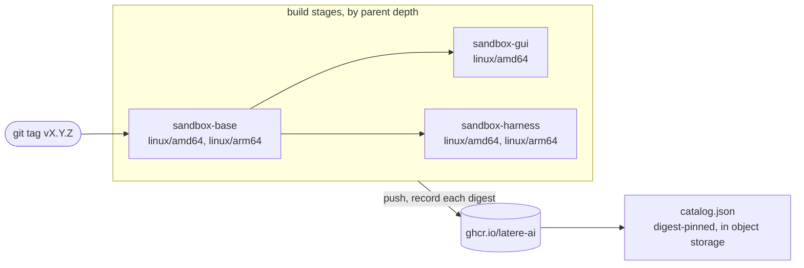

# Contributing

For people changing an image, adding one, or cutting a release. Running the
images is covered in the [README](README.md).

## What you need

- `podman` or `docker`. The tooling uses `RUNTIME`, which defaults to
  `podman`.
- [`yq`](https://github.com/mikefarah/yq) (v4) and `jq`. Every script reads
  `catalog.yaml` through them.
- `bash` and `make`.

Run `make hooks` once after cloning; it points git at `.githooks`.

## Layout

| Path | What it is |
| --- | --- |
| [`catalog.yaml`](catalog.yaml) | the list of images: name, build context, platforms, parent, label, description, resource hints. The Makefile targets, the CI build matrices, `test.sh`, and the published `catalog.json` all derive from it, and its fields are documented inline |
| [`catalog.sh`](catalog.sh) | everything derived from the catalog: `lint`, `filters`, `matrix`, `compose`, `baseref`, `build`, `clean` |
| `base/`, `gui/`, `harness/` | one build context per image |
| [`test.sh`](test.sh), [`catalog_test.sh`](catalog_test.sh), [`gui/entrypoint_test.sh`](gui/entrypoint_test.sh) | the three test suites |
| [`specs/`](specs/) | design records for changes to the catalog and the image contract |

## Building

```bash
make            # build every image in catalog order
make base       # build one image; its parent chain builds first
make gui
make harness
make test       # run the catalog tooling tests
make clean      # remove the locally built images
make hooks      # point git at .githooks
```

The per-image targets are the context directories in `catalog.yaml`, so a new
image directory becomes a `make` target with no Makefile change. Use another
runtime with `make RUNTIME=docker`.

A local build is tagged `<name>:latest` and `ghcr.io/latere-ai/<name>:latest`.
An image with a parent builds FROM the parent's local `<parent>:latest`,
passed as the `BASE_IMAGE` build argument.

## Testing

| Command | What it covers | Needs |
| --- | --- | --- |
| `make test` | the catalog tooling: lint rules, change filters, build matrices, parent resolution, and `catalog.json` composition, against the live catalog and fixtures | `yq`, `jq` |
| `bash gui/entrypoint_test.sh` | VNC password provisioning in the GUI image. It sources the script directly and needs no container | `bash` |
| `bash test.sh [tag]` | the published images at a tag (default `latest`): every cataloged image pulls and runs, and each image's runtime contract holds (tools on `PATH`, user, home, working directory, prompt, display defaults, pinned CLI versions) | a container runtime, `yq` |

`test.sh` pulls every image from the registry before checking it, so it
verifies what is published. A local build under the same name is replaced by
the pulled image. `RUNTIME` and `REGISTRY` override the runtime and the
registry.

On every push to `main` and every pull request, CI runs `./catalog.sh lint`
and `make test`, and smoke-builds, without pushing, each image whose context
directory changed together with the images built on it. A child image in that
smoke build uses its parent's published `latest`, not the parent built in the
same run.
`gui/entrypoint_test.sh` and `test.sh` run in no workflow: run the first
before tagging a change to the GUI startup path, and run `bash test.sh vX.Y.Z`
after a release publishes.

## Adding an image

1. Create a directory with a `Dockerfile`. An image built on another image
   from this repository starts with `ARG BASE_IMAGE=<parent>:latest` and
   `FROM ${BASE_IMAGE}`, as `gui/` and `harness/` do.
2. Add an entry to `catalog.yaml`. List order is build order, so a parent
   comes before its children.
3. Run `./catalog.sh lint` and `make test`.
4. Add checks for the image's runtime contract to `test.sh`.

No Makefile or workflow edit is needed. `./catalog.sh lint` refuses a catalog
where:

- a name is not lowercase letters, digits, and dashes, or a name or context is
  repeated;
- a context has no `Dockerfile`;
- `platforms`, `label`, or `description` is missing, or `defaults` carries a
  key other than `cpu_milli`, `memory_mb`, `width`, and `height`;
- `from` names an image that is not declared earlier;
- a parent chain is deeper than three images, because the pipelines build in
  three stages;
- a `COPY` source is missing from its context or excluded by the context's
  `.dockerignore`;
- a `Dockerfile` pipes the NodeSource setup script into `bash`, fetches the
  NodeSource signing key at build time, or downloads the Go toolchain without
  a `sha256sum -c` check;
- the release workflow names an image literally instead of reading the
  catalog.

## Updating a pinned version

| What | Where | Note |
| --- | --- | --- |
| Go | `GO_VERSION`, `GO_SHA256_amd64`, `GO_SHA256_arm64` in `base/Dockerfile` | take both digests from `https://go.dev/dl/?mode=json` and change them in the same commit as the version; the build fails on a mismatch |
| gopls, delve, golangci-lint | `GOPLS_VERSION`, `DLV_VERSION`, `GOLANGCI_LINT_VERSION` in `base/Dockerfile` | the other Go tools install `@latest` at build time |
| Node.js | `NODE_MAJOR` in `base/Dockerfile` | the NodeSource signing key is vendored as `base/nodesource.gpg.key`, and the build checks its fingerprint against `NODE_KEY_FPR` |
| Chrome for Testing | `CFT_VERSION` in `gui/Dockerfile` | amd64 only |
| Claude Code, Codex | `CLAUDE_CODE_VERSION`, `CODEX_VERSION` in `harness/Dockerfile` | `test.sh` checks that the published CLIs report these versions |

## Releasing

Releases are tag-driven and handled by `.github/workflows/release.yml`.



- **A `vX.Y.Z` tag** builds every image in catalog order and pushes each one as
  `vX.Y.Z`, `vX.Y`, and `latest`. A child image builds FROM the digest its
  parent pushed earlier in the same run, never from a moving tag. The run then
  composes `catalog.json` from `catalog.yaml` and the recorded digests and
  uploads it twice: to `${PREFIX}/catalog.json`, the current catalog, and to
  `${PREFIX}/history/<tag>.json`, a copy per release.
- **Publishing a GitHub release** runs the same pipeline for the release's tag.
  For a tag that was already pushed, that builds and pushes the images again.
- **A manual dispatch** pushes `latest` and publishes no catalog. By default
  it rebuilds only the images that have a parent, FROM the parent's published
  `latest`, and tags them with `image_tag` as well when it is set; set
  `rebuild_base` to rebuild the base images too.
- **A push to `main`** runs the same build matrix for the changed images and
  pushes nothing.

The catalog upload reads the repository secrets `CATALOG_S3_ENDPOINT`,
`CATALOG_S3_REGION`, `CATALOG_S3_BUCKET`, `CATALOG_S3_PREFIX`,
`CATALOG_S3_ACCESS_KEY`, and `CATALOG_S3_SECRET_KEY`, and a release fails when
the bucket is not set. A fork publishes its own catalog by setting them.

## Sending a change

Keep one logical change per commit. A larger change, such as one to the image
contract or to the shape of `catalog.json`, starts as a spec in `specs/`. A bug
fix carries a test that fails without it.
