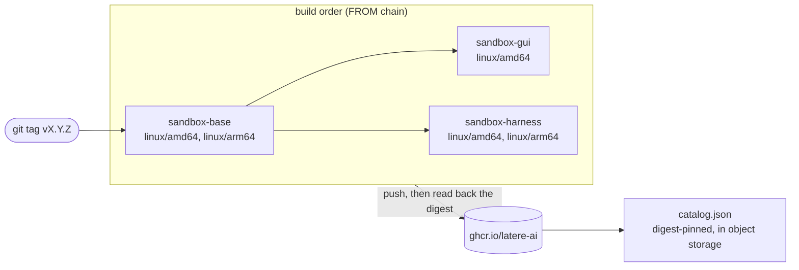

# Sandbox Images

[](https://github.com/latere-ai/images/actions/workflows/ci.yml)
[](LICENSE)

Container images that run coding agents and computer-use sessions in a sandbox. They back the Cella sandbox platform and run standalone under Docker or Podman.

## Images

| Image | Registry reference | Platforms | Contents |
| --- | --- | --- | --- |
| `sandbox-base` | `ghcr.io/latere-ai/sandbox-base` | amd64, arm64 | OS packages, Go and Go tooling, Node.js 22, Python 3, non-root `agent` user |
| `sandbox-gui` | `ghcr.io/latere-ai/sandbox-gui` | amd64 | base plus the GUI/VNC stack for computer-use workflows |
| `sandbox-harness` | `ghcr.io/latere-ai/sandbox-harness` | amd64, arm64 | base plus the Claude Code and Codex CLIs for agent workloads |

Each image builds FROM the one above it, and a release pushes them in that order:



The image inventory lives in [`catalog.yaml`](catalog.yaml); the CI build matrix, the Makefile targets, `test.sh`, and the published catalog all derive from it. To add an image: create a context directory with a `Dockerfile`, add one entry to `catalog.yaml`, done. `catalog.yaml` documents every field inline; `./catalog.sh lint` validates it (and `bash catalog_test.sh` tests the tooling itself).

## What's inside

The base image (Ubuntu 24.04, multi-arch amd64/arm64) provides:

- **OS**: Ubuntu 24.04 with `build-essential`, `git`, `curl`, `wget`, `vim`, `jq`, `ripgrep`, `openssh-client`
- **Go**: pinned via the `GO_VERSION` ARG in `base/Dockerfile`, plus tooling (gopls, goimports, delve, golangci-lint, staticcheck, gosec, and more)
- **Node.js**: 22 LTS
- **Python**: 3 with pip and venv
- **Non-root user**: `agent` (UID 1000), passwordless sudo

Image-specific additions:

- **sandbox-gui**
  - Xvfb display, XFCE desktop session, x11vnc, websockify/noVNC, xdotool, ImageMagick, and Chrome for Testing
  - Exposes noVNC on port `6080` and defaults to `SCREEN_GEOMETRY=1280x800x24`
- **sandbox-harness**
  - Claude Code and Codex CLIs, installed system-wide (versions pinned via ARGs in `harness/Dockerfile`)
  - Pre-created `~/.claude` and `~/.codex` so a single credential file can be bind-mounted

## Using pre-built images

Pre-built images are published to GHCR on every release:

```bash
# Pull the base image
podman pull ghcr.io/latere-ai/sandbox-base:latest

# Pull a specific version
podman pull ghcr.io/latere-ai/sandbox-base:vX.Y.Z

# Pull the GUI variant
podman pull ghcr.io/latere-ai/sandbox-gui:latest
```

Replace `podman` with `docker` if using Docker.

## Building locally

```bash
git clone https://github.com/latere-ai/images.git
cd images

make            # Build all images in catalog order
make base       # Build the base image only
make gui        # Build the GUI/VNC sandbox (builds base first)
make harness    # Build the agent harness (builds base first)
make test       # Run the catalog tooling tests
make clean      # Remove all built images
```

Build targets are the context directories from `catalog.yaml`, so a new image directory becomes a `make` target with no Makefile edit. Building requires `yq` and `jq`. Override the container runtime (default: `podman`):

```bash
make RUNTIME=docker
```

Built images are tagged as both `sandbox-base:latest` (local) and `ghcr.io/latere-ai/sandbox-base:latest` (registry name).

## Testing

Three suites, all runnable locally:

| Command | What it covers | Needs |
| --- | --- | --- |
| `make test` | the catalog tooling: lint rules, change filters, build-matrix staging, and `catalog.json` composition | `yq`, `jq` |
| `bash gui/entrypoint_test.sh` | VNC password provisioning for the GUI image; sources the script directly, no container | bash |
| `bash test.sh [tag]` | the images themselves at a tag (default `latest`): every cataloged image runs, and each one's runtime contract holds | a container runtime, `yq`, and the images available locally or on GHCR |

CI runs `./catalog.sh lint` against the committed catalog plus the first suite. `gui/entrypoint_test.sh` and `test.sh` are not wired into either workflow, so a change to the GUI startup path or to an image's runtime contract is not covered by a branch build. Run both by hand before cutting a release tag.

## Running standalone

You can run these images directly. Mount a workspace directory into the container under `/workspace`.

### Base sandbox

```bash
docker run --rm -it \
  -v "$(pwd)":/workspace/myproject \
  -w /workspace/myproject \
  ghcr.io/latere-ai/sandbox-base:latest \
  bash
```

The container runs as the non-root `agent` user with `/home/agent` as `$HOME`. Install any agent CLI you need inside the sandbox (e.g. `npm install -g <cli>`).

### GUI sandbox

`sandbox-gui` is an image for computer-use workflows. It starts an Xvfb display, a lightweight XFCE desktop, x11vnc, and a noVNC websocket bridge.

The GUI image is published for `linux/amd64` because Chrome for Testing does not ship a Linux arm64 archive. On arm64 hosts, run it with `--platform linux/amd64`.

Run it locally and open noVNC:

```bash
docker run --rm -it \
  --platform linux/amd64 \
  -p 6080:6080 \
  -v "$(pwd)":/workspace/myproject \
  -w /workspace/myproject \
  ghcr.io/latere-ai/sandbox-gui:latest
```

Then visit `http://localhost:6080/vnc.html`. The entrypoint creates `~/.vncpass` (mode 0600) on first boot. Read the generated password with `docker exec <container> cat ~/.vncpass`; it is never written to the container logs. Set `VNC_PASSWORD` or replace that file when orchestration owns attach credentials.

Launch Chromium directly inside the display:

```bash
docker run --rm -it \
  --platform linux/amd64 \
  -p 6080:6080 \
  ghcr.io/latere-ai/sandbox-gui:latest \
  chromium-launch https://example.com
```

### Notes

- Replace `docker` with `podman` if preferred.
- Mount additional project directories as needed under `/workspace/`.
- To limit resources: `--cpus 2 --memory 4g`.

## Releases and the published catalog

Releases are tag-driven and self-contained in `release.yml`. Pushing a `vX.Y.Z` tag builds every cataloged image in dependency order and pushes each one to GHCR as `v{version}`, `v{major}.{minor}`, and `latest`. Each image is built FROM the digest its parent produced in the same run, so a concurrent release cannot move a base image out from under an image that builds on it. Publishing a GitHub release triggers the same build and push. A manual dispatch also publishes, and can skip the base rebuild and stamp one extra tag on the images built on top of it.

Pushes to `main` publish nothing. `ci.yml` lints the catalog, runs the tooling tests, and smoke-builds the images whose context directory changed; `release.yml` runs the same build matrix with pushing disabled.

The pipeline composes `catalog.json` from `catalog.yaml` plus the built image digests and uploads it to S3-compatible object storage:

- `${PREFIX}/catalog.json`: the current catalog, overwritten each release
- `${PREFIX}/history/<tag>.json`: an immutable copy per release

Consumers use this to discover published images. The contract (top-level `version: 1`, bumped on breaking changes):

```json
{
  "version": 1,
  "source": { "repo": "latere-ai/images", "commit": "<sha>", "tag": "v0.0.13" },
  "images": [
    {
      "name": "sandbox-gui",
      "ref": "ghcr.io/latere-ai/sandbox-gui:v0.0.13",
      "digest": "sha256:...",
      "platforms": ["linux/amd64"],
      "label": "GUI",
      "description": "...",
      "defaults": { "cpu_milli": 500, "memory_mb": 1024, "width": 1280, "height": 800 }
    }
  ]
}
```

`ref` is always the immutable release tag, never `latest`. `defaults` is optional advisory resource hints.

Publication is configured through repository secrets: `CATALOG_S3_ENDPOINT`, `CATALOG_S3_REGION`, `CATALOG_S3_BUCKET`, `CATALOG_S3_PREFIX`, `CATALOG_S3_ACCESS_KEY`, `CATALOG_S3_SECRET_KEY`. A release fails if they are unset.

## Image contract

These details are relevant if you are building custom images on top of the sandboxes or integrating them into your own orchestration.

- **Working directory**: `/workspace` (workspaces are mounted as subdirectories)
- **User**: non-root `agent` (UID 1000), passwordless sudo, `$HOME=/home/agent`
- **Prompt**: the shell prompt prefers the `CELLA_HOST` env var (the runtime-injected instance name) and falls back to the kernel hostname when unset
- **GUI mode**: `sandbox-gui` starts its own XFCE desktop on `DISPLAY=:0` and serves noVNC from port `6080`; override `SCREEN_GEOMETRY` to change the boot-time display size

## Status and stability

The `catalog.json` contract carries a top-level `version`, currently `1`. A breaking change to its shape bumps that number. Image references inside it always point at an immutable release tag, so a consumer pinning from the catalog never follows a moving tag.

The published image tags follow the release tag. `vX.Y.Z` and `vX.Y` are stable once pushed; `latest` moves with every release. Pin `vX.Y.Z` or a digest for reproducible builds.

The image contract above is the surface consumers build against. Tool versions inside an image change freely between releases; the working directory, user, ports, and environment variables do not.

## License

MIT. See [LICENSE](LICENSE).
